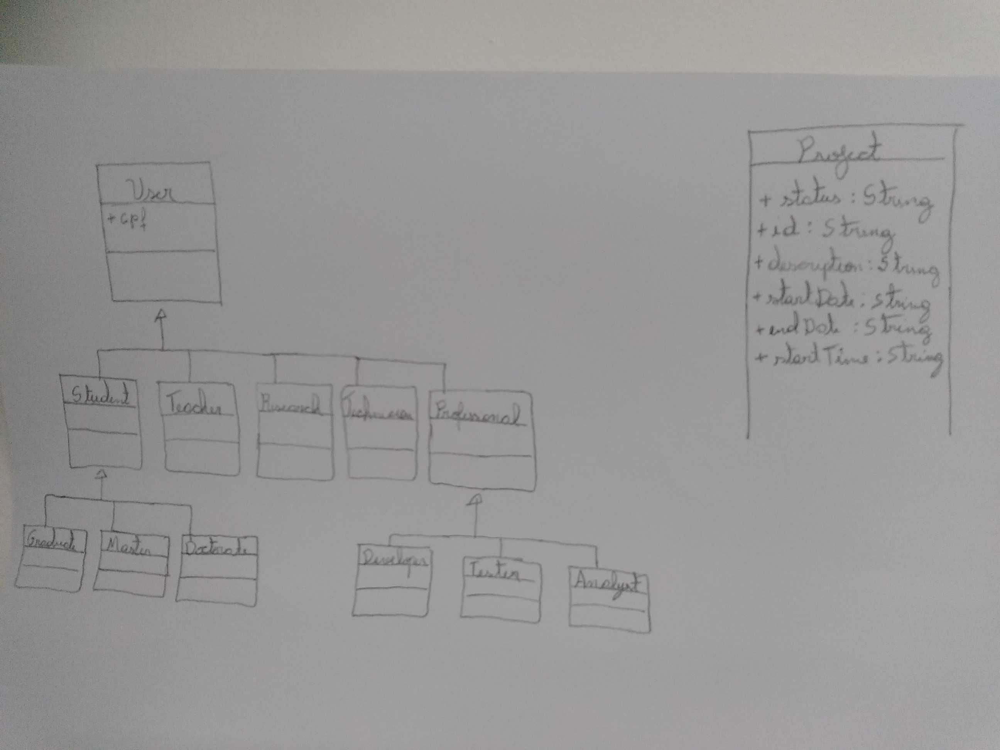

# System for Project Management / P3_EXAM

## *Functionalities*

- [x] Create project
- [x] Create user
- [x] Create task
- [x] Add project information
- [x] Remove project information
- [x] Add user to project
- [x] Add user to task
- [x] Project data checking
- [x] Change project status
- [x] Show user information
- [x] Show project information
- [x] Show task information
- [x] Show academic unit information

## *Classes, inheritances and abstract*

```
º USER: Existe um conjunto de classes que herdam da classe 'User', que são 'Student', 'Teacher','Researcher', 'Professional',
'Technician', além dessas, as classes abstratas 'Graduate', 'Master' e 'Doctorate' herdam da classe abstrata 'Student',
por fim 'Developer', 'Tester' e 'Analyst' herdam de profissional. A motivação da abstrata é que essas classes existem mais
para idealizar um tipo e a herança entre as classe foi utilizada por conta do reuso dos métodos e atributos.

º PROJECTS AND TASKS: Existe uma classe 'Project' e uma classe chamada 'Task'.

º SCREENS: Existem as classes 'LoginMenu', 'SystemMenu', 'ChangeProgressMenu', 'RelatoryMenu' e 'CreateUserMenu' todas com intuito
de criar uma interface básica via console para que o usuário possa escolher uma das opções mostradas e que faça a chamada de fluxo
do sistema com base na opção escolhida. A motivação é apresentar uma forma simples do usuário utilizar o sistema.

º UTILITIES: Existe uma classe 'Useful' com intuito de obter métodos uteis ao sistema, como limpeza de tela e pausa do sistema.

º DATABASES: Existe uma classe 'Database' com intuito de criar armazenar os usuários, projetos e atividades da unidade academica.
```

## *Exceptions*

```
EXCEPTIONS NO FLUXO: O fluxo do sistema e sua interação com o usuário depende da escolha de opções que são enumeradas e
mostradas, sendo que esse dado escolhido pelo usuário é um inteiro e pode ser que seja digitada uma letra ao invés de um número
na faixa enumerada, dessa forma foi implementado a exceção inputmismatchexception() com try e catch para evitar esse tipo de erro
do usuário. 
```
## *Distribution of methods*
- _**O intuito desse tópico será demonstrar a distribuição dos métodos com base nas funcionalidades**_
_**acima dando enfase em quais classes foram implementados.**_
```
SCRENS: Nas classes 'LoginMenu', 'SystemMenu', 'ChangeProgressMenu', 'RelatoryMenu' e 'CreateUserMenu', existem basicamente dois 
tipos de métodos, um método que mostra um menu ao usuário com as opções enumeradas e dar a opção dele escolher entre elas e por fim
um método que direcionada o fluxo com base na oção escolhida. Exemplo de métodos: 'public void loginMenuScreen(Databse database)' e
'public boolean LoginMenuDecision(int option, Database database)', essa metodologia se estender para todos os outros menus.

DATABASE: Na Classe Database foi implementada as funções de adicionar 

```

## *Reuse*

```
USER: Por conta da herança aplicada nas classes que derivam de 'User' obtivemos um grande reuso dos métodos e atributos das classes
pai.

USEFUL: A classe 'Useful' possui os métodos 'public void cleanScreen()' e 'public void pause()', o primeiro método se torna presente
sempre que um menu precisa ser mostrado para o usuário e o segundo método é usado sempre que uma funcionalidade é completada e é 
preciso pausar o sistema para mostrar uma msg ao usuário de tarefa completa ou incompleta.

DATABASE: Houve um grande reuso na classe database uma vez que foi centralizado em apenas uma classe todas as bases de dados,
dessa forma não necessitando criar diversas classse de database para projeto, atividades e usuários.
```

## *Extensibility and interface*

```
CONTRATO: Foi utilizado a interface em situações de requisição ao usuário de informações imprecindiveis como identificação de uma classe,
pois sem essa informação a busca por um projeto, atividade ou usuário se tornaria passivel de falhas ou demandaria uma programação desnecessária.
A interface foi mais presente na criação de usuários, projeto e atividades.

Extensibilidade: É notada através da modularização feita onde cada classe possui apenas métodos em que estejam lidando com os
atributos da classe, não obstante a aplicação da herança, tais práticas facilitam no momento da manutenção e quando queremos
extender nosso sistema.  
```

## *Polymorphism*

```
NOTE: Não vi necessidade para implementar polimorfismo uma vez que os métodos necessários para o funcionamento do sistema não
requerem execuções da mesma funcionalidade com caracteristicas especificas em um cojunto de classes, sendo assim, cada método
possui sua execução restrita apenas a classe na qual se encontra não necessitando de overwrite.
```

## UML image



